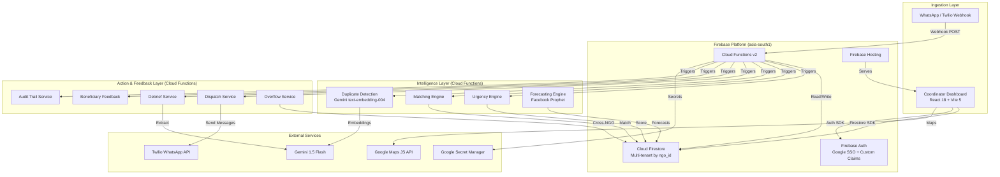
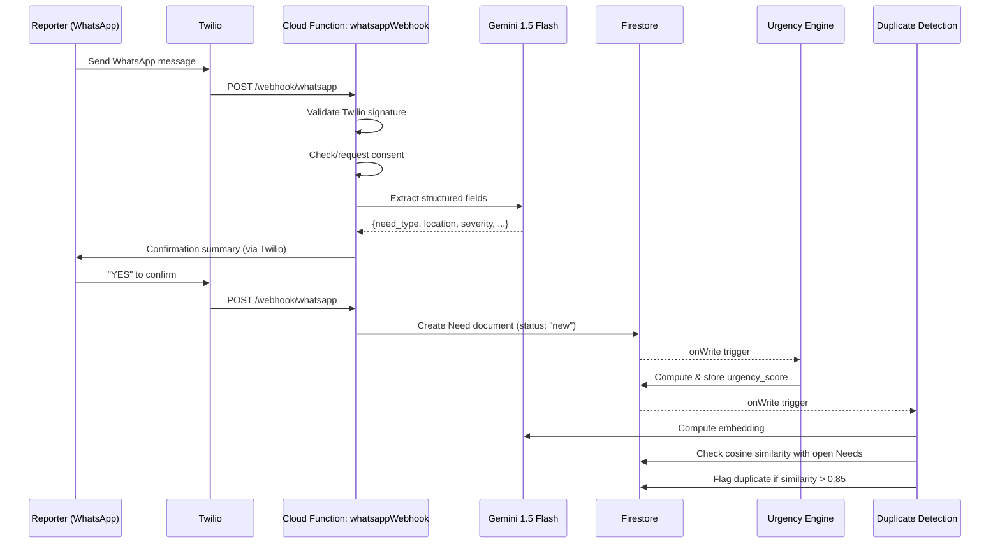
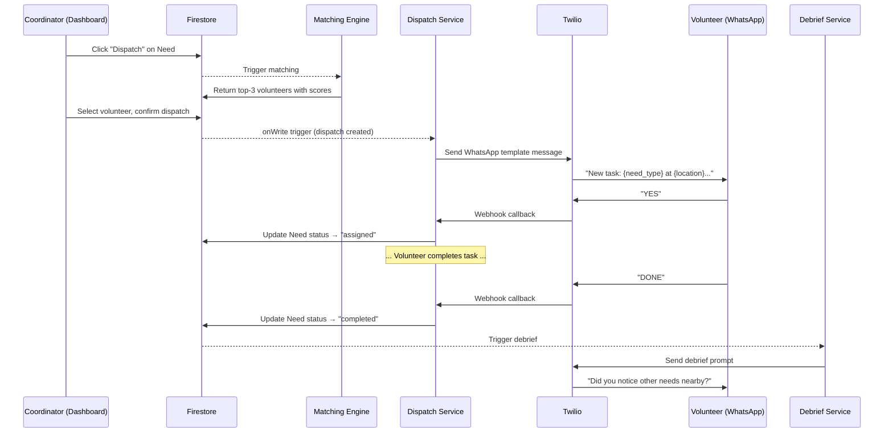

# Design Document: CommunityOS Core Platform

## Overview

CommunityOS is a production-grade, multi-tenant NGO coordination platform built on Firebase. It replaces the existing Express/Gemini chat prototype with a full-stack system that ingests community needs via WhatsApp (text and voice), scores them with a transparent urgency formula, matches volunteers using a transparent matching formula, dispatches via WhatsApp, captures post-task debriefs, predicts future need volumes, and provides a real-time coordinator dashboard.

The system follows a three-layer architecture:

1. **Ingestion Layer** — WhatsApp text/voice via Twilio webhooks, web dashboard input
2. **Intelligence Layer** — Urgency Engine, Matching Engine, Duplicate Detection, Forecasting Engine
3. **Action & Feedback Layer** — Dispatch Service, Debrief Loop, Beneficiary Feedback, Audit Trail

All services run on Firebase (Cloud Functions v2, Firestore, Hosting, Auth) in the `asia-south1` region. Multi-tenancy is enforced at every layer via `ngo_id` partitioning. RBAC uses Firebase Auth custom claims with four roles: `super_admin`, `ngo_admin`, `coordinator`, `volunteer`.

### Key Design Decisions

| Decision | Choice | Rationale |
|---|---|---|
| Database | Cloud Firestore native-mode | Real-time listeners for dashboard, serverless scaling, Security Rules for tenant isolation |
| Backend compute | Cloud Functions v2 + Cloud Run | Event-driven triggers for Firestore writes, HTTPS endpoints for webhooks and API |
| Frontend | React 18 + Vite 5 + Tailwind CSS 3 | Fast builds, utility-first styling, responsive by default |
| AI extraction | Gemini 1.5 Flash | Multimodal (text + audio), multilingual, low latency |
| Embeddings | Gemini text-embedding-004 | High-quality embeddings for duplicate detection via cosine similarity |
| Forecasting | Facebook Prophet | Proven time-series forecasting, handles seasonality, works with sparse data |
| Messaging | Twilio WhatsApp Business API | Reliable delivery, template messages, webhook-based inbound |
| Auth | Firebase Auth + Google SSO | Zero-friction sign-in, custom claims for RBAC, integrates with Security Rules |
| Multi-tenancy | Logical partitioning by `ngo_id` | Simpler than separate projects, enforced by Security Rules + Cloud Function validation |
| Audit trail | Append-only Firestore subcollection | Immutable by Security Rules, chronological, queryable |

## Architecture

### High-Level Architecture Diagram



### Request Flow: WhatsApp Need Report



### Request Flow: Volunteer Dispatch




## Components and Interfaces

### 1. WhatsApp Webhook Handler (`whatsappWebhook`)

**Type:** Cloud Function v2 (HTTPS trigger)
**Endpoint:** `POST /webhook/whatsapp`

Receives all inbound WhatsApp messages from Twilio. Routes messages based on context:
- New reporters → Consent flow → Need extraction pipeline
- Active volunteers → Command handler (YES/NO/DONE/HELP/AVAILABLE/BUSY)
- Debrief sessions → Debrief extraction pipeline
- Confirmation flows → YES/EDIT handling

```typescript
interface WhatsAppInboundMessage {
  From: string;           // WhatsApp phone number (whatsapp:+91...)
  Body: string;           // Text content
  NumMedia: string;       // Number of media attachments
  MediaUrl0?: string;     // Voice note URL (if present)
  MediaContentType0?: string; // e.g., "audio/ogg"
}

interface ConversationContext {
  phone: string;
  ngo_id: string;
  state: 'idle' | 'awaiting_consent' | 'collecting_need' | 'awaiting_confirmation' |
         'editing_fields' | 'dispatched' | 'debrief_active';
  pending_need?: Partial<Need>;
  extraction_confidence?: Record<string, number>;
  debrief_question_count?: number;
  language: 'en' | 'hi' | 'pa';
}
```

**Responsibilities:**
- Validate Twilio request signature
- Maintain conversation state in Firestore (`conversations/{phone}`)
- Route to appropriate handler based on conversation state
- Queue messages when Gemini is unavailable (Requirement 25.1)

### 2. Gemini Extraction Service (`extractionService`)

**Type:** Internal module used by Cloud Functions

Wraps Gemini 1.5 Flash for structured field extraction from text and voice.

```typescript
interface ExtractionResult {
  need_type: string;
  location: { lat: number; lng: number; description: string };
  severity: number;          // 1-10
  affected_count: number;
  vulnerability_flags: VulnerabilityFlag[];
  confidence: Record<string, number>; // per-field confidence 0.0-1.0
  language: 'en' | 'hi' | 'pa';
  raw_input: string;
}

type VulnerabilityFlag = 'children' | 'elderly' | 'pregnant' | 'disabled' | 'medical_emergency';

interface ExtractionService {
  extractFromText(text: string, language?: string): Promise<ExtractionResult>;
  extractFromAudio(audioUrl: string): Promise<ExtractionResult>;
  generateFollowUp(field: string, language: string): string;
}
```

**Key behaviors:**
- Returns per-field confidence scores
- If any field confidence < 0.7, flags it for follow-up (Requirement 7.4)
- For audio, if transcription confidence < 0.5, returns error (Requirement 8.4)
- Supports English, Hindi, Punjabi

### 3. Urgency Engine (`urgencyEngine`)

**Type:** Cloud Function v2 (Firestore onWrite trigger on `needs/{needId}`)

```typescript
interface UrgencyScoreBreakdown {
  severity: number;
  affected_count: number;
  vulnerability_flags: VulnerabilityFlag[];
  vulnerability_multiplier: number;  // capped at 2.0
  hours_since_reported: number;
  urgency_score: number;
  computed_at: string;               // ISO 8601 timestamp
}

interface UrgencyEngine {
  computeScore(need: Need): UrgencyScoreBreakdown;
  serializeBreakdown(breakdown: UrgencyScoreBreakdown): string;  // JSON
  parseBreakdown(json: string): UrgencyScoreBreakdown;
  formatBreakdown(breakdown: UrgencyScoreBreakdown): string;     // Human-readable
}
```

**Formula:** `urgency_score = (severity × affected_count × vulnerability_multiplier) / hours_since_reported`

**Vulnerability multiplier calculation:**
```
sum = 1.0
for each flag in vulnerability_flags:
  children → sum += 0.4
  elderly → sum += 0.3
  pregnant → sum += 0.4
  disabled → sum += 0.2
  medical_emergency → sum += 0.6
vulnerability_multiplier = min(sum, 2.0)
```

**Scheduled recomputation:** Cloud Scheduler triggers every 15 minutes to recompute all open Needs (Requirement 5.4).

**Defaults:** If severity is missing → 3, if affected_count is missing → 1, flag for review (Requirement 5.5).

### 4. Matching Engine (`matchingEngine`)

**Type:** Cloud Function v2 (HTTPS callable)

```typescript
interface MatchScoreBreakdown {
  volunteer_id: string;
  skill_match: number;        // 0.0-1.0
  distance_km: number;
  availability_score: number; // 0.0, 0.5, or 1.0
  burnout_factor: number;
  reliability_score: number;  // 0-100
  match_score: number;
}

interface MatchingEngine {
  findMatches(need: Need, ngo_id: string): Promise<MatchScoreBreakdown[]>;
  computeSkillMatch(needSkills: string[], volunteerSkills: string[]): number;
  computeDistance(loc1: GeoPoint, loc2: GeoPoint): number; // Haversine
  computeAvailability(volunteer: Volunteer): number;
}
```

**Formula:** `match_score = skill_match × (1 / (distance_km + 1)) × availability_score × (1 / burnout_factor)`

**For high-severity needs (severity > 7):** `match_score *= (reliability_score / 100)`

**Exclusions:** Volunteers with status "busy", burnout_factor > 5.0, or who previously declined the same Need.

**Overflow trigger:** If fewer than 3 volunteers score above 0.1, flag for cross-NGO overflow (Requirement 9.7).

### 5. Dispatch Service (`dispatchService`)

**Type:** Cloud Function v2 (Firestore onWrite trigger on `dispatches/{dispatchId}`)

```typescript
interface Dispatch {
  id: string;
  need_id: string;
  volunteer_id: string;
  ngo_id: string;
  status: 'pending' | 'sent' | 'accepted' | 'declined' | 'escalated' | 'completed';
  sent_at?: Timestamp;
  responded_at?: Timestamp;
  escalation_count: number;
  match_score_breakdown: MatchScoreBreakdown;
}

interface DispatchService {
  sendDispatch(dispatch: Dispatch): Promise<void>;
  handleResponse(phone: string, command: VolunteerCommand): Promise<void>;
  escalate(dispatch: Dispatch): Promise<void>;
}

type VolunteerCommand = 'YES' | 'NO' | 'DONE' | 'HELP' | 'AVAILABLE' | 'BUSY';
```

**Escalation:** 15-minute timeout via Cloud Tasks delayed trigger. If no response, dispatch to next-ranked volunteer.

### 6. Debrief Service (`debriefService`)

**Type:** Cloud Function v2 (triggered when Need status → "completed")

```typescript
interface DebriefSession {
  id: string;
  need_id: string;
  volunteer_id: string;
  ngo_id: string;
  status: 'active' | 'completed' | 'no_new_needs';
  questions_asked: number;    // max 3
  new_need_ids: string[];     // Needs created from debrief
}

interface DebriefService {
  initiateDebrief(need: Need, volunteer: Volunteer): Promise<void>;
  processResponse(session: DebriefSession, message: string): Promise<void>;
}
```

### 7. Duplicate Detection Service (`duplicateDetectionService`)

**Type:** Cloud Function v2 (Firestore onCreate trigger on `needs/{needId}`)

```typescript
interface DuplicateDetectionService {
  computeEmbedding(text: string): Promise<number[]>;
  cosineSimilarity(a: number[], b: number[]): number;
  findDuplicates(need: Need, ngo_id: string): Promise<DuplicateCandidate[]>;
}

interface DuplicateCandidate {
  existing_need_id: string;
  similarity_score: number;  // 0.0-1.0
}
```

**Threshold:** cosine similarity > 0.85 within 5 km radius.

### 8. Forecasting Engine (`forecastingEngine`)

**Type:** Cloud Run service (scheduled weekly retraining, on-demand predictions)

```typescript
interface ForecastResult {
  need_type: string;
  area: string;
  predictions: { date: string; predicted_count: number; lower_bound: number; upper_bound: number }[];
  confidence: 'high' | 'reduced';  // 'reduced' if < 30 data points
  early_warnings: EarlyWarning[];
}

interface EarlyWarning {
  need_type: string;
  area: string;
  predicted_date: string;
  predicted_count: number;
  percentile_90_threshold: number;
  message: string;
}
```

### 9. Overflow Service (`overflowService`)

**Type:** Cloud Function v2 (HTTPS callable)

```typescript
interface OverflowRequest {
  need_id: string;
  source_ngo_id: string;
  shared_fields: {
    need_type: string;
    general_area: string;  // Not exact location
    severity: number;
    required_skills: string[];
  };
}

interface OverflowService {
  requestOverflow(request: OverflowRequest): Promise<void>;
  acceptOverflow(need_id: string, accepting_ngo_id: string): Promise<void>;
  resolveOverflow(need_id: string): Promise<void>;
}
```

### 10. Audit Trail Service (`auditTrailService`)

**Type:** Internal module invoked by all state-changing operations

```typescript
interface AuditEntry {
  timestamp: Timestamp;
  actor_id: string;
  actor_role: 'super_admin' | 'ngo_admin' | 'coordinator' | 'volunteer' | 'system';
  action_type: string;
  previous_value: any;
  new_value: any;
  source: 'web' | 'whatsapp' | 'system';
}

interface AuditTrailService {
  append(need_id: string, entry: AuditEntry): Promise<void>;
  getTrail(need_id: string): Promise<AuditEntry[]>;
}
```

### 11. Consent Service (`consentService`)

**Type:** Internal module used by WhatsApp webhook handler

```typescript
interface ConsentToken {
  id: string;
  phone: string;
  ngo_id: string;
  granted_at: Timestamp;
  revoked_at?: Timestamp;
  status: 'active' | 'revoked';
}

interface ConsentService {
  requestConsent(phone: string, ngo_id: string, language: string): Promise<void>;
  grantConsent(phone: string, ngo_id: string): Promise<ConsentToken>;
  revokeConsent(phone: string, ngo_id: string): Promise<void>;
  hasValidConsent(phone: string, ngo_id: string): Promise<boolean>;
}
```

### 12. Reliability Score Service (`reliabilityScoreService`)

**Type:** Cloud Function v2 (triggered on dispatch completion and feedback events)

```typescript
interface ReliabilityScoreService {
  computeScore(volunteer: Volunteer): number;  // 0-100
  updateOnCompletion(volunteer_id: string, response_time_minutes: number): Promise<void>;
  updateOnDecline(volunteer_id: string): Promise<void>;
  updateOnFeedback(volunteer_id: string, rating: number): Promise<void>;
}
```

**Formula:**
```
reliability_score = (completion_rate × 0.4 + response_time_score × 0.3 + feedback_score × 0.3) × 100
```

### 13. Blog Generation Service (`blogGenerationService`)

**Type:** Cloud Function v2 (HTTPS callable)

```typescript
interface BlogGenerationService {
  generateStory(need_ids: string[], ngo_id: string): Promise<BlogDraft>;
  anonymizeContent(content: string): string;
  publishStory(story_id: string): Promise<string>;  // Returns public URL
}

interface BlogDraft {
  id: string;
  title: string;
  content: string;  // Markdown
  source_need_ids: string[];
  ngo_id: string;
  status: 'draft' | 'approved' | 'published';
}
```

### 14. Health Check Service (`healthCheckService`)

**Type:** Cloud Function v2 (HTTPS endpoint)
**Endpoint:** `GET /health`

```typescript
interface HealthStatus {
  status: 'healthy' | 'degraded';
  services: {
    firestore: 'up' | 'down';
    gemini: 'up' | 'down';
    twilio: 'up' | 'down';
  };
  timestamp: string;
}
```

### 15. Coordinator Dashboard (React Frontend)

**Stack:** React 18, Vite 5, Tailwind CSS 3, Google Maps JS API, Recharts

**Key pages/components:**
- `MapView` — Google Maps with color-coded Need markers (red > 8, orange 4–8, green < 4)
- `NeedList` — Ranked list sorted by urgency_score descending
- `NeedDetail` — Full Need details, urgency breakdown, audit timeline, dispatch controls
- `DispatchPanel` — Top-3 volunteer matches with score breakdowns, dispatch button
- `ImpactDashboard` — Metrics summary, trend charts (Recharts), CSV export
- `ForecastView` — 7-day forecast charts with early warning indicators
- `InventoryManager` — Resource inventory CRUD, threshold alerts
- `OverflowPanel` — Cross-NGO overflow requests and responses
- `BlogEditor` — AI-generated story review and publish
- `AdminPanel` — User management, role assignment, NGO settings

**Real-time updates:** Firestore `onSnapshot` listeners on `needs`, `dispatches`, `inventory`, `system_alerts` collections filtered by `ngo_id`.

**Offline support:** Service worker caches previously loaded data; offline actions queued and synced on reconnect with last-write-wins conflict resolution.


## Data Models

### Firestore Collections

All collections use `ngo_id` as a top-level field for logical multi-tenancy. Firestore Security Rules enforce that users can only access documents where `resource.data.ngo_id == request.auth.token.ngo_id`.

#### `ngos/{ngoId}`
```typescript
interface NGO {
  id: string;
  name: string;
  region: string;
  settings: {
    overflow_enabled: boolean;
    overflow_partners: string[];  // ngo_ids with bilateral consent
    inventory_thresholds: Record<string, number>;  // resource_type → min quantity
  };
  created_at: Timestamp;
  updated_at: Timestamp;
}
```

#### `needs/{needId}`
```typescript
interface Need {
  id: string;
  source: 'whatsapp' | 'voice' | 'web' | 'debrief';
  location: {
    lat: number;
    lng: number;
    description: string;
  };
  need_type: string;
  severity: number;              // 1-10
  affected_count: number;
  vulnerability_flags: VulnerabilityFlag[];
  urgency_score: number;
  urgency_breakdown: UrgencyScoreBreakdown;
  status: 'new' | 'triaged' | 'assigned' | 'in_progress' | 'completed' | 'verified' | 'archived';
  assigned_volunteer_id?: string;
  ngo_id: string;
  consent_token: string;
  duplicate_of?: string;         // need_id if flagged as duplicate
  recurrence_group_id?: string;
  debrief_source_need_id?: string; // If created from debrief
  embedding?: number[];          // text-embedding-004 vector
  raw_input: string;
  language: 'en' | 'hi' | 'pa';
  reporter_phone?: string;
  created_at: Timestamp;
  updated_at: Timestamp;
  audit_trail_id: string;
}
```

#### `needs/{needId}/audit_entries/{entryId}` (append-only subcollection)
```typescript
interface AuditEntry {
  id: string;
  timestamp: Timestamp;
  actor_id: string;
  actor_role: 'super_admin' | 'ngo_admin' | 'coordinator' | 'volunteer' | 'system';
  action_type: string;           // e.g., 'status_change', 'volunteer_assigned', 'escalation'
  previous_value: any;
  new_value: any;
  source: 'web' | 'whatsapp' | 'system';
}
```

#### `volunteers/{volunteerId}`
```typescript
interface Volunteer {
  id: string;
  name: string;
  phone: string;
  location: {
    lat: number;
    lng: number;
    description: string;
  };
  skills: string[];
  availability: {
    windows: { day: string; start: string; end: string }[];  // e.g., {day: "monday", start: "09:00", end: "17:00"}
  };
  ngo_id: string;
  reliability_score: number;     // 0-100
  burnout_factor: number;        // 1.0 = fresh, higher = more burned out
  status: 'available' | 'busy' | 'under_review';
  task_history: {
    total_completed: number;
    total_declined: number;
    total_escalated: number;
    avg_response_time_minutes: number;
    avg_feedback_rating: number;
  };
  created_at: Timestamp;
  updated_at: Timestamp;
}
```

#### `dispatches/{dispatchId}`
```typescript
interface Dispatch {
  id: string;
  need_id: string;
  volunteer_id: string;
  ngo_id: string;
  status: 'pending' | 'sent' | 'accepted' | 'declined' | 'escalated' | 'completed';
  match_score_breakdown: MatchScoreBreakdown;
  sent_at?: Timestamp;
  responded_at?: Timestamp;
  completed_at?: Timestamp;
  escalation_count: number;
  escalation_timeout_task_id?: string;  // Cloud Tasks ID for 15-min timeout
  created_at: Timestamp;
}
```

#### `inventory/{itemId}`
```typescript
interface InventoryItem {
  id: string;
  resource_type: string;
  quantity: number;
  location: { lat: number; lng: number; description: string };
  ngo_id: string;
  expiry_date?: Timestamp;
  status: 'available' | 'depleted' | 'expired';
  created_at: Timestamp;
  updated_at: Timestamp;
}
```

#### `forecasts/{forecastId}`
```typescript
interface Forecast {
  id: string;
  ngo_id: string;
  need_type: string;
  area: string;
  predictions: { date: string; predicted_count: number; lower_bound: number; upper_bound: number }[];
  confidence: 'high' | 'reduced';
  early_warnings: EarlyWarning[];
  trained_at: Timestamp;
  created_at: Timestamp;
}
```

#### `zones/{zoneId}`
```typescript
interface Zone {
  id: string;
  ngo_id: string;
  name: string;
  boundary: { lat: number; lng: number }[];  // Polygon vertices
  assigned_coordinators: string[];
}
```

#### `debriefs/{debriefId}`
```typescript
interface Debrief {
  id: string;
  need_id: string;
  volunteer_id: string;
  ngo_id: string;
  status: 'active' | 'completed' | 'no_new_needs';
  questions_asked: number;
  new_need_ids: string[];
  messages: { role: 'system' | 'volunteer'; content: string; timestamp: Timestamp }[];
  created_at: Timestamp;
  completed_at?: Timestamp;
}
```

#### `consents/{consentId}`
```typescript
interface Consent {
  id: string;
  phone: string;
  ngo_id: string;
  status: 'active' | 'revoked';
  granted_at: Timestamp;
  revoked_at?: Timestamp;
}
```

#### `audit_events/{eventId}` (system-wide audit log)
```typescript
// Same structure as AuditEntry but for cross-cutting events
// (e.g., role changes, overflow events, consent changes)
```

#### `api_tokens/{tokenId}`
```typescript
interface ApiToken {
  id: string;
  ngo_id: string;
  name: string;
  hashed_token: string;
  permissions: string[];
  created_at: Timestamp;
  expires_at: Timestamp;
}
```

#### `system_alerts/{alertId}`
```typescript
interface SystemAlert {
  id: string;
  ngo_id: string;
  type: 'early_warning' | 'inventory_low' | 'dispatch_delay' | 'service_degraded';
  severity: 'info' | 'warning' | 'critical';
  message: string;
  metadata: Record<string, any>;
  acknowledged: boolean;
  created_at: Timestamp;
}
```

#### `posts/{postId}`
```typescript
interface Post {
  id: string;
  ngo_id: string;
  title: string;
  content: string;           // Markdown
  source_need_ids: string[];
  status: 'draft' | 'approved' | 'published';
  published_url?: string;
  created_at: Timestamp;
  published_at?: Timestamp;
}
```

#### `conversations/{phone}` (WhatsApp conversation state)
```typescript
interface Conversation {
  phone: string;
  ngo_id: string;
  state: 'idle' | 'awaiting_consent' | 'collecting_need' | 'awaiting_confirmation' |
         'editing_fields' | 'dispatched' | 'debrief_active';
  pending_need?: Partial<Need>;
  extraction_confidence?: Record<string, number>;
  debrief_session_id?: string;
  language: 'en' | 'hi' | 'pa';
  updated_at: Timestamp;
}
```

#### `message_queue/{messageId}` (resilience queue)
```typescript
interface QueuedMessage {
  id: string;
  type: 'pending_extraction' | 'pending_send';
  payload: any;
  ngo_id: string;
  retry_count: number;
  max_retries: number;
  next_retry_at: Timestamp;
  status: 'queued' | 'processing' | 'completed' | 'failed';
  created_at: Timestamp;
}
```

### Firestore Security Rules (Key Rules)

```
rules_version = '2';
service cloud.firestore {
  match /databases/{database}/documents {

    // Tenant isolation: all collections require ngo_id match
    function isAuthenticated() {
      return request.auth != null;
    }
    function getUserNgoId() {
      return request.auth.token.ngo_id;
    }
    function getUserRole() {
      return request.auth.token.role;
    }
    function isTenantMatch() {
      return resource.data.ngo_id == getUserNgoId();
    }
    function isSuperAdmin() {
      return getUserRole() == 'super_admin';
    }

    // Needs collection
    match /needs/{needId} {
      allow read: if isAuthenticated() && (isTenantMatch() || isSuperAdmin());
      allow create: if isAuthenticated() && request.resource.data.ngo_id == getUserNgoId();
      allow update: if isAuthenticated() && isTenantMatch() &&
                       getUserRole() in ['coordinator', 'ngo_admin', 'super_admin'];

      // Audit entries: append-only, no update or delete
      match /audit_entries/{entryId} {
        allow read: if isAuthenticated() && isTenantMatch();
        allow create: if isAuthenticated();
        allow update, delete: if false;  // Immutable
      }
    }

    // Volunteers collection
    match /volunteers/{volunteerId} {
      allow read: if isAuthenticated() && (isTenantMatch() || isSuperAdmin());
      allow write: if isAuthenticated() && isTenantMatch() &&
                      getUserRole() in ['coordinator', 'ngo_admin', 'super_admin'];
    }
  }
}
```

### Firestore Indexes

Key composite indexes needed:
- `needs`: `(ngo_id ASC, status ASC, urgency_score DESC)` — ranked list query
- `needs`: `(ngo_id ASC, status ASC, created_at DESC)` — recent needs
- `volunteers`: `(ngo_id ASC, status ASC, reliability_score DESC)` — matching queries
- `dispatches`: `(ngo_id ASC, need_id ASC, status ASC)` — dispatch lookup
- `inventory`: `(ngo_id ASC, resource_type ASC, status ASC)` — inventory queries
- `forecasts`: `(ngo_id ASC, need_type ASC, created_at DESC)` — latest forecasts


## Correctness Properties

*A property is a characteristic or behavior that should hold true across all valid executions of a system — essentially, a formal statement about what the system should do. Properties serve as the bridge between human-readable specifications and machine-verifiable correctness guarantees.*

### Property 1: Tenant Data Isolation

*For any* Firestore query executed by a user with `ngo_id = A`, the query results SHALL contain only documents where `ngo_id = A` and never documents where `ngo_id = B` (for any B ≠ A), unless the document is an accepted overflow Need with bilateral consent.

**Validates: Requirements 3.1, 3.3, 15.4**

### Property 2: RBAC Permission Matrix Enforcement

*For any* combination of user role (`super_admin`, `ngo_admin`, `coordinator`, `volunteer`) and API endpoint action, the system SHALL permit the action if and only if the role-permission matrix allows it, returning HTTP 403 for all unauthorized attempts.

**Validates: Requirements 4.3, 4.4, 4.5**

### Property 3: Urgency Score Formula Correctness

*For any* valid Need with `severity` ∈ [1,10], `affected_count` ≥ 1, any combination of `vulnerability_flags`, and `hours_since_reported` > 0, the computed `urgency_score` SHALL equal `(severity × affected_count × vulnerability_multiplier) / hours_since_reported`, where `vulnerability_multiplier = min(1.0 + sum_of_flag_weights, 2.0)` with weights: children=0.4, elderly=0.3, pregnant=0.4, disabled=0.2, medical_emergency=0.6. The stored breakdown SHALL contain all component values.

**Validates: Requirements 5.1, 5.2, 5.3**

### Property 4: Need List Urgency Ordering

*For any* list of open Needs displayed on the Coordinator Dashboard, the list SHALL be sorted by `urgency_score` in strictly descending order (i.e., for all adjacent pairs, the preceding Need's score is ≥ the following Need's score).

**Validates: Requirements 6.2**

### Property 5: Match Score Formula Correctness

*For any* valid Need and available Volunteer within the same tenant, the computed `match_score` SHALL equal `skill_match × (1 / (distance_km + 1)) × availability_score × (1 / burnout_factor)`, where `skill_match` is the ratio of intersecting skills to required skills (0.0–1.0), `availability_score` is 1.0 (current window), 0.5 (within 4 hours), or 0.0 (otherwise), and `burnout_factor` ≥ 1.0. For Needs with `severity > 7`, the score SHALL be further multiplied by `reliability_score / 100`.

**Validates: Requirements 9.1, 9.2, 9.4, 18.4**

### Property 6: Haversine Distance Properties

*For any* two geographic coordinate pairs (lat₁, lng₁) and (lat₂, lng₂) with valid ranges (lat ∈ [-90, 90], lng ∈ [-180, 180]), the haversine distance SHALL satisfy: (a) non-negativity: `distance ≥ 0`, (b) identity: `distance(A, A) = 0`, (c) symmetry: `distance(A, B) = distance(B, A)`, and (d) triangle inequality: `distance(A, C) ≤ distance(A, B) + distance(B, C)`.

**Validates: Requirements 9.3**

### Property 7: Matching Engine Exclusion and Ranking

*For any* set of Volunteers evaluated by the Matching Engine, the returned top-3 results SHALL (a) never include Volunteers with `status = "busy"`, `burnout_factor > 5.0`, or who previously declined the same Need, (b) be ordered by `match_score` descending, and (c) contain at most 3 entries, all with `match_score > 0.1` (or fewer if insufficient qualifying Volunteers exist).

**Validates: Requirements 9.5, 9.6**

### Property 8: Debrief Question Limit Invariant

*For any* debrief session, the number of follow-up questions asked SHALL never exceed 3, regardless of the Volunteer's responses.

**Validates: Requirements 11.4**

### Property 9: Early Warning Threshold Correctness

*For any* forecast prediction where the predicted need volume for a `need_type` in an area exceeds the historical 90th percentile for that combination, the Forecasting Engine SHALL generate an early warning alert. Conversely, predictions at or below the 90th percentile SHALL NOT generate early warnings.

**Validates: Requirements 13.3**

### Property 10: Need-Type to Resource Mapping

*For any* Need with a recognized `need_type`, the suggested resources SHALL match the defined mapping (e.g., `food_shortage → food_kits`, `medical_emergency → medical_supplies`), and no resources outside the mapping SHALL be suggested.

**Validates: Requirements 14.2**

### Property 11: Inventory Threshold Alerting

*For any* inventory item where `quantity` drops below the configured threshold for its `resource_type`, the system SHALL generate an alert. Items at or above the threshold SHALL NOT trigger alerts.

**Validates: Requirements 14.4**

### Property 12: Overflow Data Minimization

*For any* Need shared via the Overflow Service, the data presented to partner NGOs SHALL contain only `need_type`, `general_area` (not exact coordinates), `severity`, and `required_skills`. No other Need fields (reporter phone, exact location, consent token, raw input) SHALL be included in the overflow request.

**Validates: Requirements 15.2**

### Property 13: Audit Trail Completeness and Immutability

*For any* sequence of N state-changing actions performed on a Need, the audit trail SHALL contain exactly N entries, each with all required fields (`timestamp`, `actor_id`, `actor_role`, `action_type`, `previous_value`, `new_value`, `source`), and no existing entries SHALL be modified or deleted.

**Validates: Requirements 16.1, 16.2**

### Property 14: Consent Enforcement

*For any* data processing or collection operation, the system SHALL reject the operation if no valid (non-revoked) Consent Token exists for the associated reporter phone number. No Need document SHALL be created or processed without a valid consent token.

**Validates: Requirements 17.3, 17.5**

### Property 15: Reliability Score Bounds and Computation

*For any* Volunteer, the computed `reliability_score` SHALL always be in the range [0, 100], computed as `(completion_rate × 0.4 + response_time_score × 0.3 + feedback_score × 0.3) × 100` where each component is normalized to [0, 1].

**Validates: Requirements 18.1**

### Property 16: Reliability Score Monotonicity

*For any* positive event (task completion confirmed by beneficiary), the Volunteer's `reliability_score` SHALL increase or remain the same. *For any* negative event (decline, missed response window, negative feedback), the score SHALL decrease or remain the same.

**Validates: Requirements 18.2, 18.3**

### Property 17: Reliability Score Threshold Enforcement

*For any* Volunteer with `reliability_score < 30`, the system SHALL flag the Volunteer for coordinator review and exclude them from dispatches for Needs with `severity > 7`.

**Validates: Requirements 18.5**

### Property 18: Dispatch Time Warning Threshold

*For any* 24-hour period where the average time from report to dispatch exceeds 30 minutes, the Coordinator Dashboard SHALL display a warning indicator. Periods with average ≤ 30 minutes SHALL NOT show the warning.

**Validates: Requirements 20.3**

### Property 19: Blog Content Anonymization

*For any* generated impact blog post, the content SHALL contain zero instances of beneficiary personal data (phone numbers, exact addresses, names). All personal identifiers from source Needs SHALL be replaced with generic descriptions.

**Validates: Requirements 21.2**

### Property 20: Cosine Similarity Duplicate Detection

*For any* two Need embedding vectors, the computed cosine similarity SHALL be in the range [-1, 1], and the system SHALL flag a Need as a potential duplicate if and only if the cosine similarity with an existing open Need within 5 km exceeds 0.85.

**Validates: Requirements 22.2**

### Property 21: Last-Write-Wins Conflict Resolution

*For any* set of concurrent offline and online modifications to the same document, the conflict resolution SHALL select the modification with the latest timestamp, and the final document state SHALL reflect exactly that modification's values.

**Validates: Requirements 23.4**

### Property 22: Urgency Score Serialization Round-Trip

*For any* valid `UrgencyScoreBreakdown` object, serializing to JSON, parsing back, and serializing again SHALL produce identical JSON output: `serialize(parse(serialize(x))) === serialize(x)`.

**Validates: Requirements 24.4**

### Property 23: Urgency Score Human-Readable Format Completeness

*For any* valid `UrgencyScoreBreakdown` object, the human-readable formatted string SHALL contain the values of `severity`, `affected_count`, `vulnerability_multiplier`, `hours_since_reported`, and `urgency_score`.

**Validates: Requirements 24.3**

### Property 24: Exponential Backoff Computation

*For any* retry attempt number N (0-indexed, max 2), the backoff delay SHALL equal `5 × 2^N` seconds (5s, 10s, 20s), and no more than 3 retry attempts SHALL be made.

**Validates: Requirements 25.2**


## Error Handling

### External Service Failures

| Service | Failure Mode | Handling Strategy | Fallback |
|---|---|---|---|
| Gemini 1.5 Flash | API timeout / 5xx / quota exceeded | Queue message in `message_queue` with `pending_extraction` status; send acknowledgment to user | Process queued messages when service recovers; no data loss |
| Gemini text-embedding-004 | API timeout / 5xx | Skip duplicate detection for this Need; log warning; process Need normally | Coordinator can manually check for duplicates |
| Twilio WhatsApp API | API timeout / 5xx | Queue message in `message_queue` with `pending_send` status; retry with exponential backoff (5s, 10s, 20s; max 3 retries) | After 3 failures, mark as `failed` and alert coordinator |
| Firestore | Write failure | Retry up to 3 times with exponential backoff; log full context (document path, payload, error) | After 3 failures, return error to caller; log for manual recovery |
| Google Maps JS API | Load failure | Dashboard renders without map; show list-only view with warning banner | Map loads when API becomes available |
| Facebook Prophet | Training failure | Keep previous model; log error; alert admin | Fall back to rule-based predictions only |
| Firebase Auth | Token validation failure | Return HTTP 401; do not process request | User must re-authenticate |

### Input Validation Errors

| Input | Validation | Error Response |
|---|---|---|
| Need severity | Must be 1–10 integer | Default to 3, flag for coordinator review |
| Need affected_count | Must be ≥ 1 integer | Default to 1, flag for coordinator review |
| Volunteer burnout_factor | Must be ≥ 1.0 | Clamp to 1.0 minimum |
| Urgency hours_since_reported | Must be > 0 | Use minimum of 0.01 (36 seconds) to avoid division by zero |
| Cosine similarity | Must be in [-1, 1] | Clamp to valid range |
| Reliability score | Must be in [0, 100] | Clamp to valid range |
| WhatsApp message body | Must be non-empty string | Ignore empty messages, log warning |
| Gemini extraction confidence | Must be in [0, 1] | If < 0.7 for any field, trigger follow-up question |
| Audio transcription confidence | Must be in [0, 1] | If < 0.5, ask user to resend or type instead |

### Conversation State Errors

| Scenario | Handling |
|---|---|
| Unexpected message in `idle` state | Treat as new need report; initiate consent flow if needed |
| Message during `awaiting_consent` that isn't YES/NO | Re-send consent prompt with clearer instructions |
| EDIT command with invalid field number | Re-display numbered field list |
| Volunteer command (YES/NO/DONE/HELP) with no active dispatch | Respond with "No active task found" message |
| Debrief response after session closed | Acknowledge but do not reopen session |

### Data Integrity Safeguards

- **Audit trail immutability**: Firestore Security Rules prevent update/delete on `audit_entries` subcollection. Even `super_admin` cannot modify entries.
- **Consent enforcement**: All data processing functions check for valid consent token before proceeding. Revoked tokens trigger data anonymization.
- **Tenant isolation**: Every Cloud Function validates `ngo_id` match between the requesting user's custom claim and the target document. Firestore Security Rules provide a second layer of enforcement.
- **Idempotent message processing**: WhatsApp webhook handler uses Twilio message SID as idempotency key to prevent duplicate processing of the same message.

### Circuit Breaker Pattern

For external services (Gemini, Twilio), implement a circuit breaker:
- **Closed** (normal): Requests pass through normally
- **Open** (after 5 consecutive failures in 60 seconds): Requests immediately queue/fallback without attempting the external call
- **Half-open** (after 30 seconds in open state): Allow one test request; if successful, close circuit; if failed, reopen

The health check endpoint (`GET /health`) reports circuit breaker states for each external service.

## Testing Strategy

### Testing Framework Selection

| Layer | Framework | Purpose |
|---|---|---|
| Backend unit tests | Jest | Cloud Functions, engines, services |
| Backend property tests | fast-check (with Jest) | Correctness properties for pure computations |
| Frontend unit tests | Vitest | React components, hooks, utilities |
| Frontend property tests | fast-check (with Vitest) | Correctness properties for frontend logic |
| E2E tests | Playwright | Full user flows through the dashboard |
| Firestore Security Rules | @firebase/rules-unit-testing | Tenant isolation and RBAC rule validation |
| Integration tests | Jest + Firebase Emulator Suite | End-to-end Cloud Function flows with emulated services |

### Property-Based Testing Configuration

- Library: **fast-check** (JavaScript/TypeScript PBT library)
- Minimum iterations: **100 per property test**
- Each property test tagged with: `Feature: communityos-core-platform, Property {N}: {title}`
- Properties implemented as single `fc.assert(fc.property(...))` calls

### Test Categories

#### Unit Tests (Jest / Vitest)
- Urgency Engine: formula computation with specific examples, default value handling, edge cases (zero hours, max vulnerability)
- Matching Engine: specific matching scenarios, exclusion rules, overflow triggering
- Dispatch Service: command handling (YES/NO/DONE/HELP/AVAILABLE/BUSY), escalation logic
- Debrief Service: session lifecycle, question counting, need creation from debrief
- Consent Service: grant/revoke/check lifecycle
- Reliability Score: computation with specific histories, threshold behavior
- Audit Trail: entry creation, field validation
- Duplicate Detection: cosine similarity computation, threshold behavior
- Blog Generation: anonymization of specific PII patterns
- Health Check: status aggregation logic

#### Property Tests (fast-check)
Each correctness property (Properties 1–24) implemented as a property-based test:

- **Properties 3, 5, 6, 15, 24**: Pure mathematical computations — generate random valid inputs, verify formula correctness
- **Property 22**: Round-trip serialization — generate random UrgencyScoreBreakdown objects, verify `serialize(parse(serialize(x))) === serialize(x)`
- **Property 23**: Format completeness — generate random breakdowns, verify all values appear in formatted string
- **Properties 4, 7**: Sorting/filtering — generate random Need/Volunteer lists, verify ordering and exclusion invariants
- **Properties 1, 2, 14**: Access control — generate random user/document/role combinations, verify isolation and permission enforcement
- **Properties 9, 10, 11, 17, 18**: Threshold behaviors — generate random values around thresholds, verify correct triggering
- **Properties 13, 16**: Invariants — generate random action sequences, verify audit completeness and score monotonicity
- **Property 8**: Counter invariant — generate random debrief sessions, verify question limit
- **Properties 12, 19**: Data filtering — generate random documents, verify only permitted fields/no PII in output
- **Property 20**: Similarity computation — generate random vectors, verify cosine similarity properties and threshold
- **Property 21**: Conflict resolution — generate random concurrent edits, verify last-write-wins

#### Integration Tests (Firebase Emulator)
- WhatsApp webhook → Gemini extraction → Need creation → Urgency scoring pipeline
- Dispatch → Volunteer response → Status update → Debrief trigger pipeline
- Cross-NGO overflow request → acceptance → resolution pipeline
- Consent grant → data collection → consent withdrawal → anonymization pipeline
- Firestore Security Rules: cross-tenant read/write rejection, audit trail immutability, role-based access

#### E2E Tests (Playwright)
- Coordinator sign-in → view map → click Need → dispatch volunteer flow
- Impact dashboard metrics display and CSV export
- Forecast view with early warning indicators
- Inventory management and threshold alerts
- Blog generation, review, and publish flow

### Test Coverage Targets

| Area | Target |
|---|---|
| Backend Cloud Functions | 80% line coverage |
| Frontend React components | 70% line coverage |
| Firestore Security Rules | 100% rule coverage |
| Correctness Properties | 100% property coverage (all 24 properties) |
| Critical paths (dispatch, urgency, matching) | 90% branch coverage |

